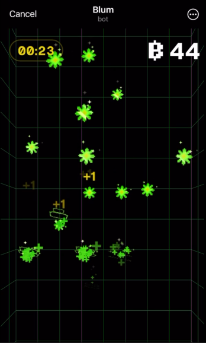
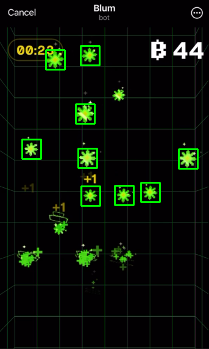

# AutoBlum - custom autoclicker for Blum

This is a custom autoclicker for Blum Telegram application to farm Blum Points with no effort.
The autoclicker takes screenshots of the screen and processes them using `OpenCV` library to detect green stars.
Then, it clicks on the detected green stars using `pyautogui` to collect Blum Points.

Images are proccessed with a given template image of a green star located in `images` directory. Screenshot is saved in `screenshots` directory and the processed result is saved in `result_image` directory.

## Algorithm

1. The script finds the Blum Telegram application
2. Once the user is ready, they need to press `q` to start the autoclicker
3. The script takes a screenshot of the screen and saves it
4. The script processes the screenshot with a given template image of a green star and detects similar looking objects, then draws rectangles around them and saves the result
5. The script clicks on the detected green stars
6. The script repeats the process until the user presses `q` again to stop the autoclicker

## Requirements

- Python 3.6+
- cv2
- pyautogui
- numpy
- keyboard
- pygetwindow
- pillow
